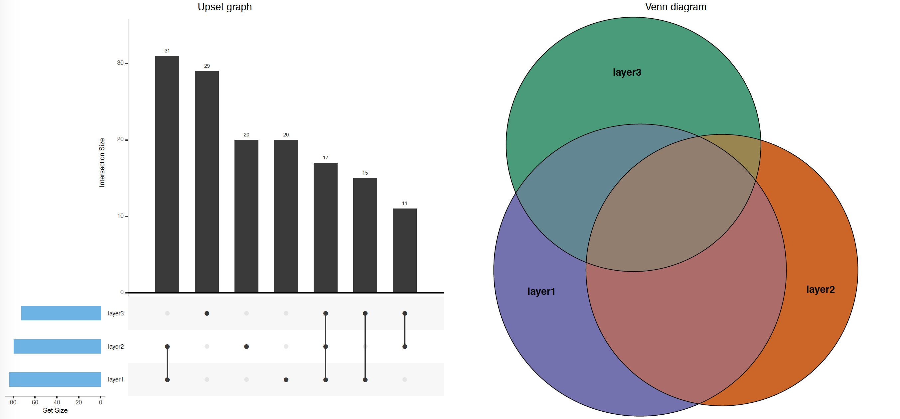

# mapping_toolkit

This repository contains python and R scripts to help process genomic coordinates files (BED, GFF).

## gff_to_bed.py 

Reverse complement of the bed_to_gff script. This script takes a GFF file and converts it into a BED formatted file (BED12 or BED6). Selection on the molecular type and feature type to extract in the arguments.

```
usage: gff_to_bed.py [-h] --gff_file GFF_FILE [--bed12] [--no_bed6]
                     [--mol_type MOL_TYPE] [--feature_type FEATURE_TYPE]
                     [--id_as_features] [--path PATH] [--name NAME]
                     [--verbose] [--discard] [--skip_exon_number]

example run :
./gff_to_bed.py -f test_files/tiny_dmel_sample_r5-57.genes.gff -b12 -v

Creates BED files from a given GFF file with specific filters. In BED12,
groups all the elements of a selected molecular type according to their
feature type.

optional arguments:
  -h, --help            show this help message and exit
  --gff_file GFF_FILE, -f GFF_FILE
                        Name of the GFF file to be converted
  --bed12, -b12         Creates the corresponding BED12 file
  --no_bed6, -nb6       Prevents from creating the corresponding BED6 file
  --mol_type MOL_TYPE, -mt MOL_TYPE
                        The molecular type (column 3 of the GFF file) selected
                        for the BED files, default is exon
  --feature_type FEATURE_TYPE, -ft FEATURE_TYPE
                        The feature type (column 9 of the GFF file) selected
                        for the BED files, default is Parent
  --id_as_features, -id
                        Will set the ID of each element as a string containing
                        all its features
  --path PATH, -p PATH  The location where BED files will be created, default
                        is current working directory
  --name NAME, -n NAME  The name of the BED files, default is the GFF file
                        name
  --verbose, -v         Will outpout in stdout the command arguments and the
                        name of each element raising a warning in consistency
                        check
  --discard, -d         Will discard the element raising a warning in strand
                        consistency and overlapping check
  --skip_exon_number, -s
                        If set, the program will skip addiing _# for exon
                        number.
```


## bed_to_gff.py 

Reverse complement of the gff_to_bed script. This script takes a BED file and converts it into a GFF formatted file. Works on BED12 and BED6.

```
usage: bed_to_gff.py [-h] --bed_file BED_FILE --source SOURCE --mol_type
                     MOL_TYPE [--is_bed12] [--make_gff3]

example run :
./bed_to_gff.py -f tiny_dmel_sample_r5-57.genes.bed6 -m exon -s dmel --make_gff3
./bed_to_gff.py -f tiny_dmel_sample_r5-57.genes.bed12 --is_bed12 -m exon -s dmel --make_gff3

Creates GFF file from a given BED file. Note that the features of the GFF are
created based on the ID of the BED file.

optional arguments:
  -h, --help            show this help message and exit
  --bed_file BED_FILE, -f BED_FILE
                        Name of the BED file to be converted
  --source SOURCE, -s SOURCE
                        Name of the source
  --mol_type MOL_TYPE, -m MOL_TYPE
                        Name of the molecular type of elements from BED
  --is_bed12            Specify this argument if bed file is bed12 formated
                        and contain blocks
  --make_gff3           Specify if you want to make the output a proper gff3
```

## summary_region_overlaps.R

This script makes a diagnosis graph to assess the level of mutual overlap between three sets of genomic coordinates. Given three BED files, it outputs a Venn diagram and an Upset plot like the one here.
Wether or not you apply the `--expand` argument as `TRUE` or `FALSE`, you get frequency of overlaps in terms of number of regions (`--expand FALSE`) or in terms of number of basepairs (`--expand TRUE`, by default).



```
Usage: /Users/flochlay/Documents/ThesisSweetThesis/These/cisReg/mapping_toolkit/summary_region_overlaps.R [options]
An R script to perfrom overlaps between 3 BED files and extract main features.

example run :
Rscript --vanilla summary_region_overlaps.R --bed1 test_files/sample1.bed --bed2 test_files/sample2.bed --bed3 test_files/sample3.bed --out test_files/overlap_summary.pdf --name1 layer1 --name2 layer2 --name3 layer3 --expand TRUE

Options:
  --bed1=CHARACTER
    First BED file

  --bed2=CHARACTER
    Second BED file

  --bed3=CHARACTER
    Third BED file

  --name1=CHARACTER
    Name of 1st overlap

  --name2=CHARACTER
    Name of 2nd overlap

  --name3=CHARACTER
    Name of 3rd overlap

  --out=OUT
    path and name of the output PDF

  --expand=CHARACTER
    If set as FALSE, overlap frequencies are based on region counts rather than base pair counts (usefull for large dataset)

  -h, --help
    Show this help message and exit
```

